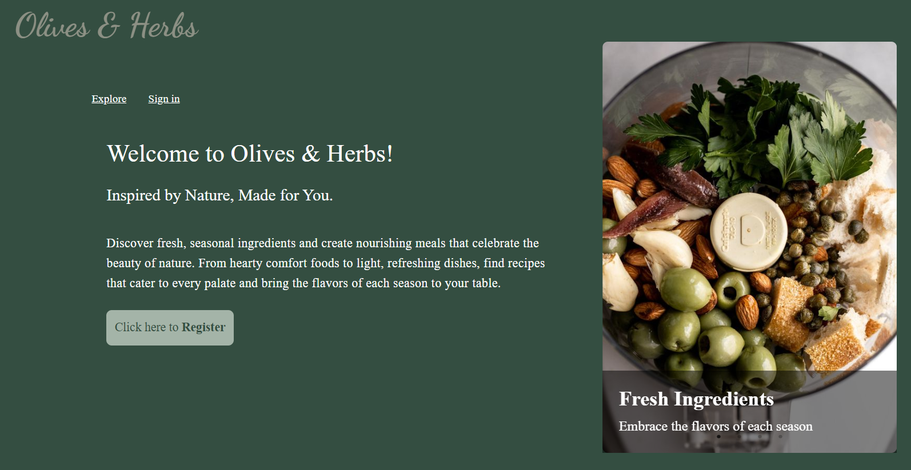
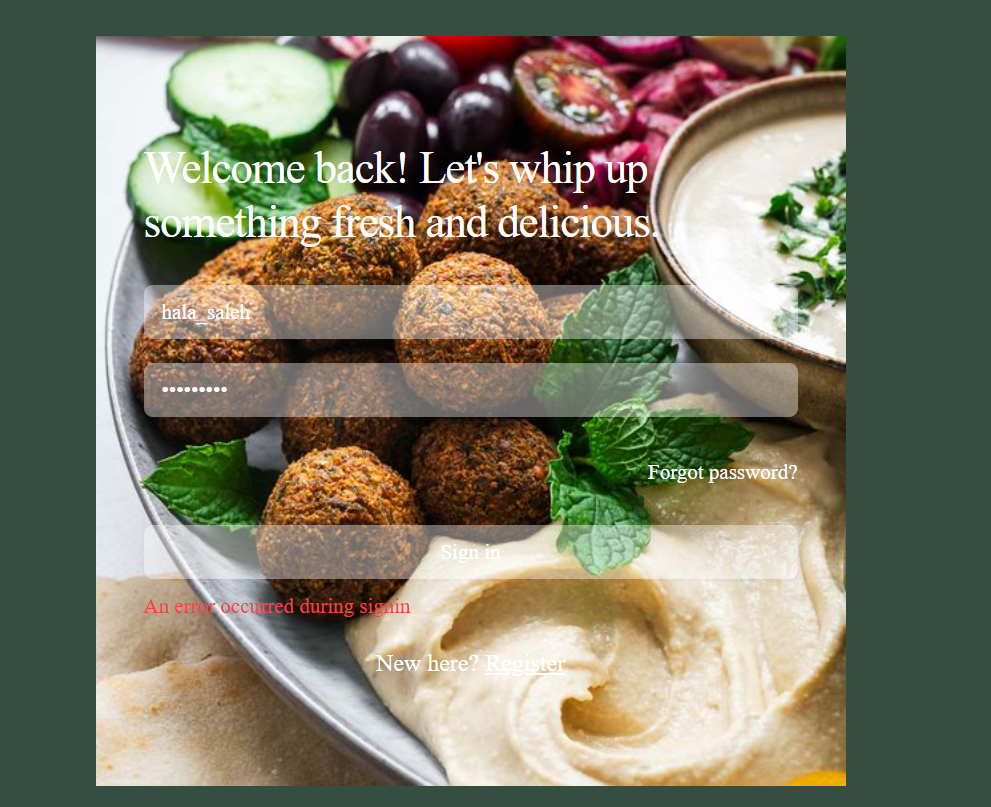
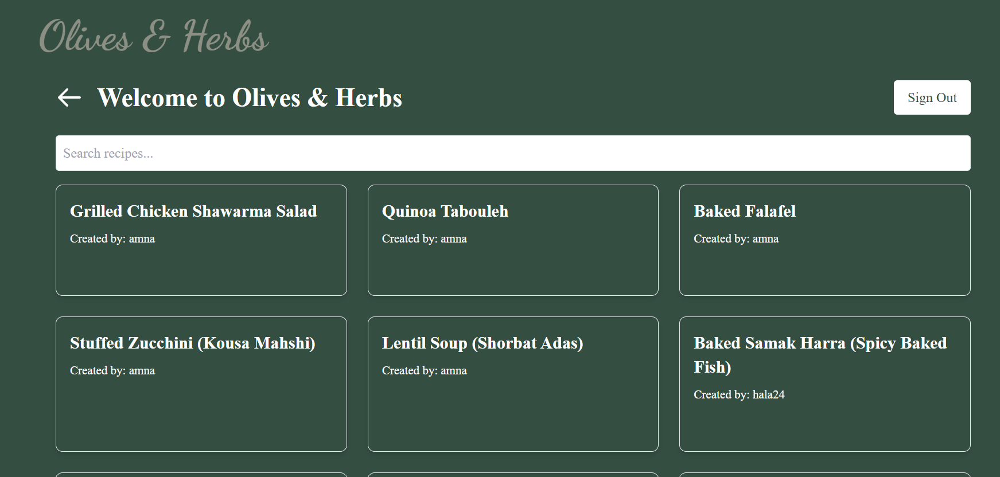
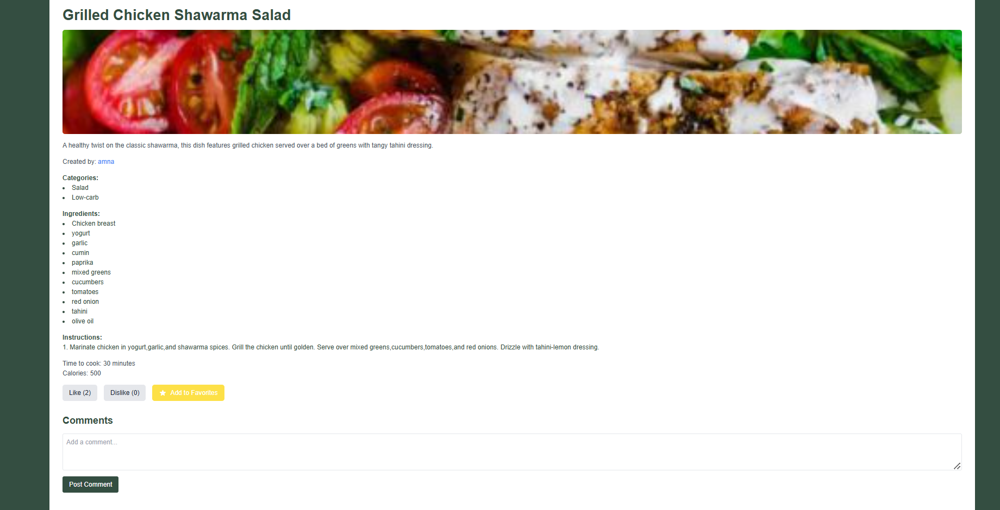
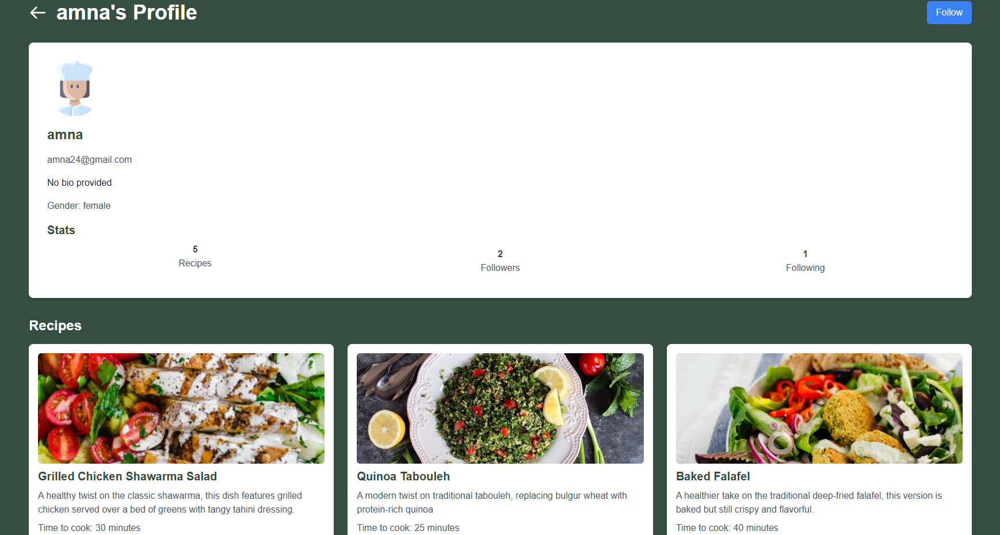
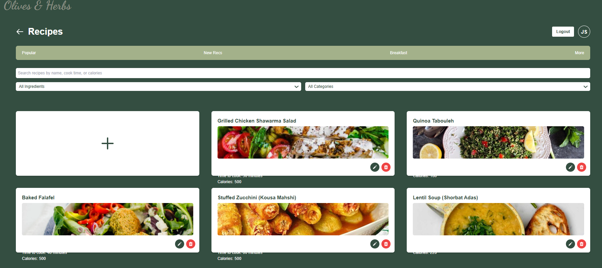

# Olives & Herbs: Recipe Media Blog

## Description
**Olives & Herbs** is an Arabic recipe social media blog where users can discover fresh, seasonal ingredients and create meals that celebrate Arabic culture.

## Features
- **User Registration:** Easy sign-up and login process.
- **Recipe Discovery:** Explore a wide variety of recipes.
- **Filter Recipes:** Filter out all recipes that contain certain ingredients.
- **Category View:** See all recipes under a specific category.
- **User Management:** Sign up, sign in, and manage user accounts easily.
- **Follower System:** Follow other users and view followers.
- **Comment on Recipes:** Share your thoughts on recipes through comments.
- **Manage Recipes:** Create, edit, and delete recipes as an authenticated user.
- **Manage Ingredients:** Create and add new ingredients while crafting recipes.

## Technologies Used
- React
- React Router
- Slick Carousel
- Tailwind CSS
- Node.js
- Express

## Backend GitHub Link
- [Backend Repository](#)

## Showcase Images
Here are some images showcasing our website:

## Contributors
- Hala Almuatiri
- Amna Alrashid
- Dalal Salam
